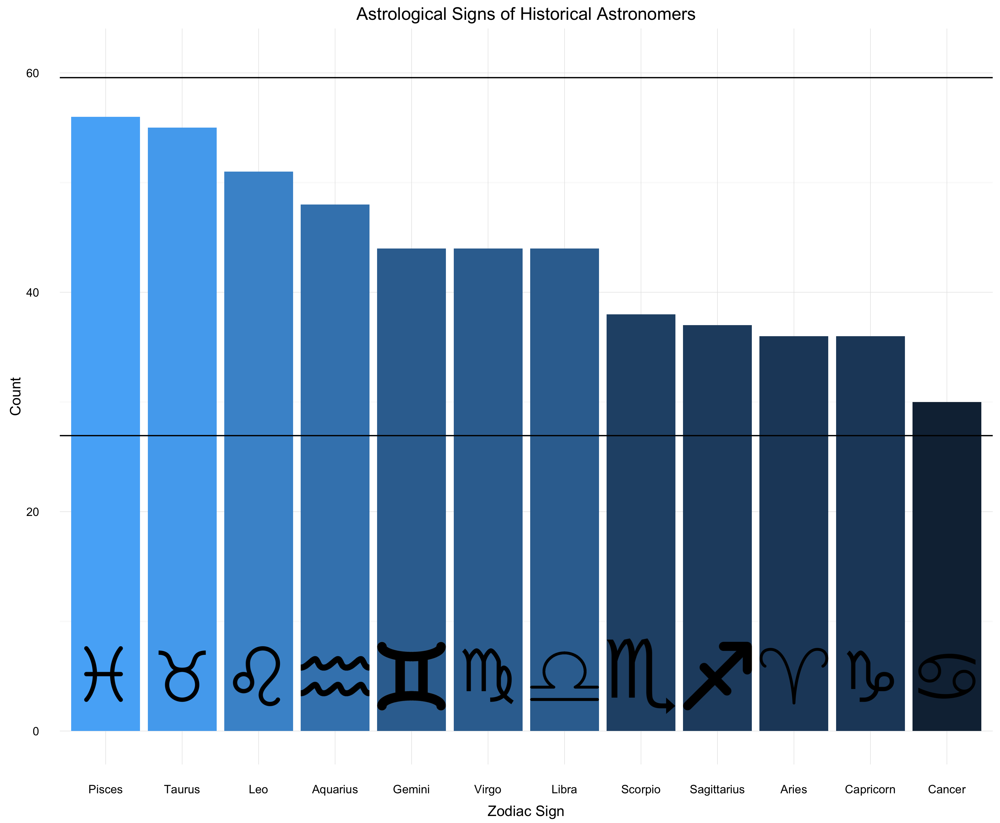
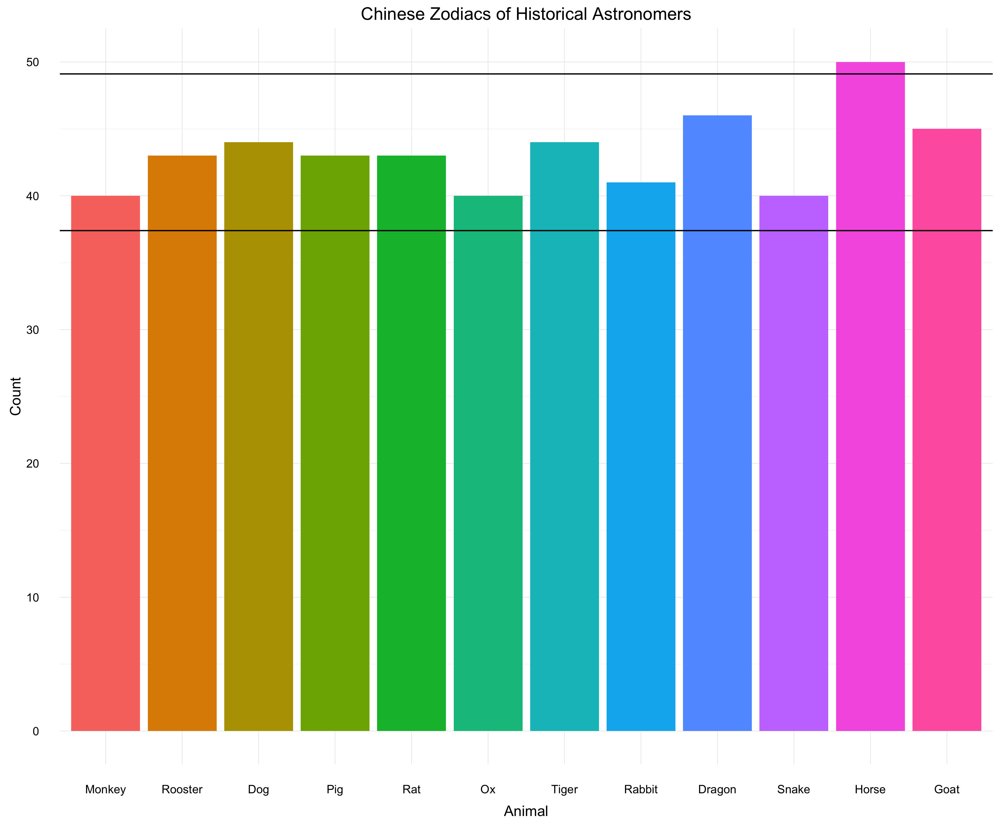
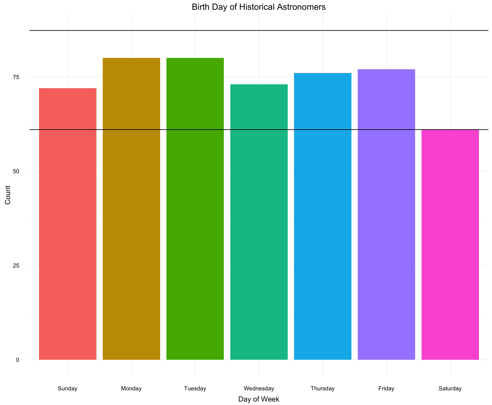

# Astrology of Astronomers

The project intends to analyze the astrological symbols of famous astronomers. The data is primarily being drawn from Wikipedia's [list of astronomers](https://en.wikipedia.org/wiki/List_of_astronomers).

### Methods

**Names:** After copying the list of astronomers into Excel, I used a manual version of regular expressions to grab just the names of the astronomers (this file is `justnames.csv`).

**Wikipedia:** Using the wikipedia package for python, I gathered wikipedia pages with the list of names. I only collected the first sentence of each of the wikipedia articles, since the birthdate is almost always in the first sentence (if known). For some articles, the sentence ended abruptly, as the wikipedia package thought "Dr." was the complete sentence, rather than "Dr. Astronomer was born on 23 July 1922." However, these occurrences were relatively infrequent and didn't diminish the results significantly.

**Unicode:** A major roadblock was that the first sentence would often contain a unicode character that couldn't be parsed, and the code would throw a `UnicodeEncodingError`. Fortunately, I was able to have it ignore those characters, and improved the capture rate from 20.4% to 94% of articles.

**Regex:** Now with a long list of first sentences (736 of them), I used regular expressions to pull out dates, formatted similar to `23 July 1922` or `July 23, 1922`. After a bit more experimenting, I didn't find any dates formatted differently. If there were multiple dates in a sentence, such as "July 23, 1922 -- August 21, 1992," the regex pulled the first date, presuming it to be the birthdate.

**Dates:** I imported the list of dates into R, and converted the date strings into Date objects. Using the day of the year, I binned each date into its respective zodiac symbol category. I aggregated the data, and found the distribution of zodiac signs.

### Graphs

As we see above, there are no obvious anomalies popping out of the data. At the 2-Sigma level (horizontal black lines), we see that all zodiac categories fall with the range. Follow up analysis will look into normalizing for the uneven birth distribution throughout the year.

If we look at the Chinese zodiac instead, we find a point of interest:

While we see a similar pattern (or lack there of) in the Chinese zodiac symbols as well, we notice that 'Horse' stands slightly above the 2-Sigma level (horizontal black lines)! While it's well within the 3-Sigma level, this warrants further study.

When we break down the dates into the days of the week, we notice that 'Saturday' is *slightly* outside the 2-Sigma level. This could partly be explained by an [increase in births during the week][1], and will need to be investigated further.

### Further Analysis

**Day of Week:** Although there is a trend towards more weekday births, I don't believe this is a significant influence in this study. Studies of birth date patterns show both Sunday and Saturday with considerably fewer than expected birthdays, with Sunday more heavily depressed. The long-term studies I found traced this pattern back to 1910, but weren't able to gather sufficient data before then. I split my data into pre-1910 and post-1910 (about 36% of total) births and compared the ratio of births per day for each set. The pre-1910 data have fewer births on Sundays than expected, while post-1910 data have slightly more than average. Both show fewer Saturday births than expected, to varying degrees.

**Chinese Zodiac:** The Chinese zodiacs seem to be the most difficult to explain, since their nature avoids seasonal variation. Patterns in the zodiac signs may be explained (under further analysis) by the uneven distribution of births over a year. However, since each Chinese zodiac covers an entire year, this is circumvented. With each zodiac repeating every 12 years, it's unlikely to be a generational difference either.

[1]: https://www.sciencedirect.com/science/article/pii/S1526952304004490

<!-- bottom -->
